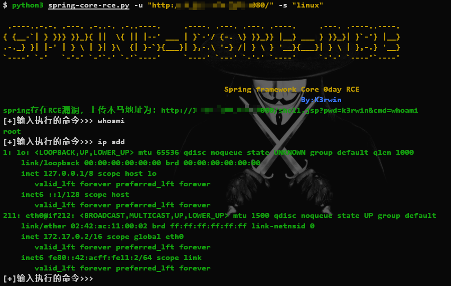
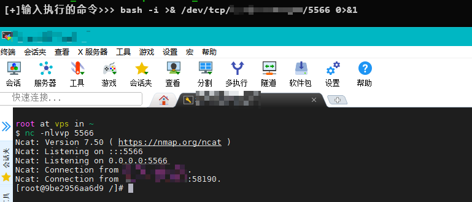

# Spring Core RCE

> 影响范围：JDK>=9 的spring框架及衍生框架
>
> [文章指路](https://thehackernews.com/2022/03/unpatched-java-spring-framework-0-day.html)
>
> **脚本仅供学习使用，如作他用所承受的法律责任一概与作者无关**

## 1.installation

~~~shell
pip3 install -r requirements.txt
~~~

## 2.Usage

```shell
$ python3 spring-core-rce.py -h

 .----..-.-. .---. .-..-. .-..----.     .----. .---. .---. .----.     .---. .----..----.
{ {__-`| } }}} }}_}{ ||  \{ || |--' ___ | }`-'/ {-. \} }}_}} |__} ___ } }}_}| }`-'} |__}
.-._} }| |-' | } \ | }| }\  {| }-`}{___}| },-.\ '-} /| } \ } '__}{___}| } \ | },-.} '__}
`----' `-'   `-'-' `-'`-' `-'`----'     `----' `---' `-'-' `----'     `-'-' `----'`----'


                                                 Spring framework Core 0day RCE
                                                                  By:K3rwin
usage: spring-core-rce.py [-h] [-u URL] [-s SYSTEM]

Spring framework Core RCE 帮助指南

optional arguments:
  -h, --help            show this help message and exit
  -u URL, --url URL     指定url
  -s SYSTEM, --system SYSTEM
                        指定目标主机操作系统,默认linux,参数为win/linux
```

## 3.example

>使用 -u指定url，-s指定操作系统  参数为：linux 或者 win，默认为linux

```shell
python3 spring-core-rce.py -u "http://1.117.155.217:8080/" -s "linux"
```





## 4.Target

### ①.本地搭建docker靶场:

`docker pull vulfocus/spring-core-rce-2022-03-29:latest`

`docker run -d -p 8080:8080 --name spring-core-rce -it vulfocus/spring-core-rce-2022-03-29`

### ②.[在线靶场](http://vulfocus.io/#/dashboard)
